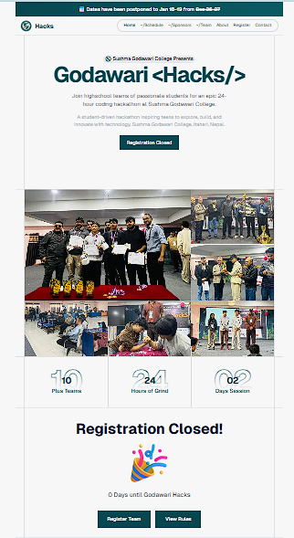

# Godawari Hacks



A minimalist hackathon management and registration portal designed for efficiency and modern aesthetics.

## Core Stack

- **Frontend**: Next.js 15, Tailwind CSS, Framer Motion
- **Backend**: Supabase (Auth & Database)
- **Deployment**: Vercel
- **Misc**: Nodemailer, Velite, React Hot Toast

## Quick Start

1. **Install Dependencies**
   ```bash
   npm install
   ```

2. **Environment Configuration**
   Copy the example environment file and fill in your Supabase and Mail credentials.
   ```bash
   cp .env.example .env
   ```

3. **Database Setup**
   Execute the SQL migrations found in the root directory within your Supabase SQL editor.

4. **Run Locally**
   ```bash
   npm run dev
   ```


---
Made for **Godawari Hacks 2026** by Manish Gole Tamang
